# Getting started with Alveo V70s in OCT

In this tutorial, we will guide you through the process of allocating a node with an AMD Alveo V70 in OCT and walk through the steps of running an example using a Vitis AI Docker container.

## Prerequisites

If you haven’t joined the OCTFPGA project yet, you can get started by following [this](https://github.com/OCT-FPGA/OCT-Tutorials/tree/master/cloudlab-setup) tutorial.

## Experiment setup
After logging into the CloudLab account, select Experiments -> Start Experiment, and type `oct-v70` in the profile search box. 
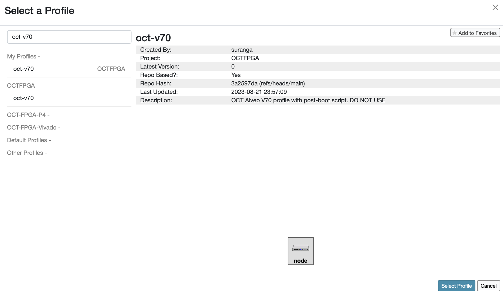
Select the profile `oct-v70`.
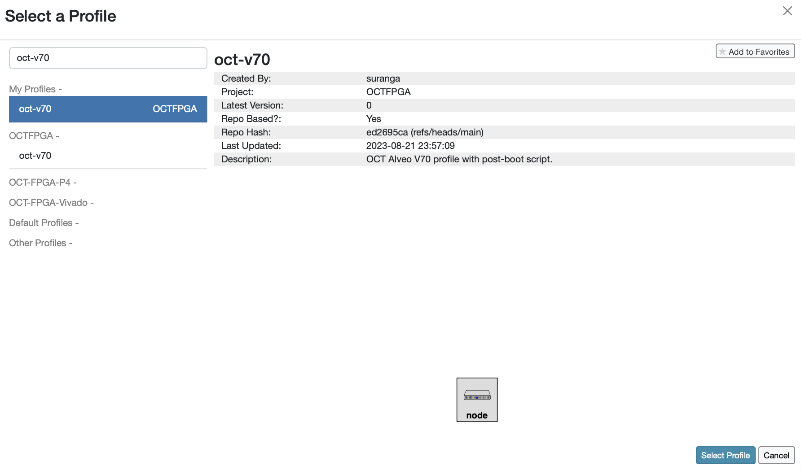
Click Next.
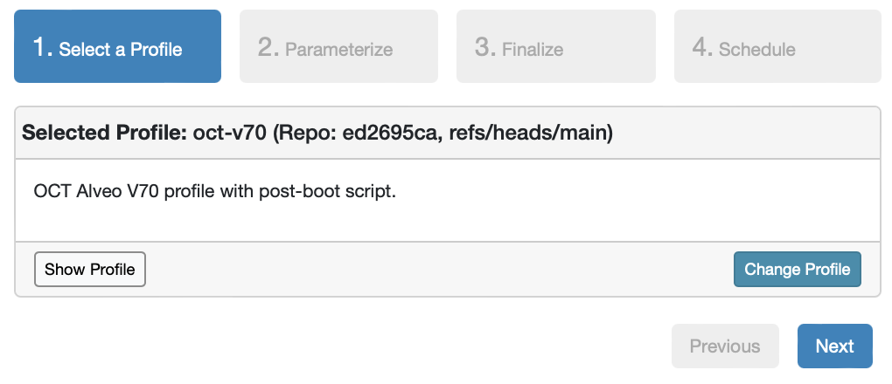
In this tutorial, you will use the Ubuntu 20.04 image with the PyTorch Docker image. Leave the default selection as is, and click Next.
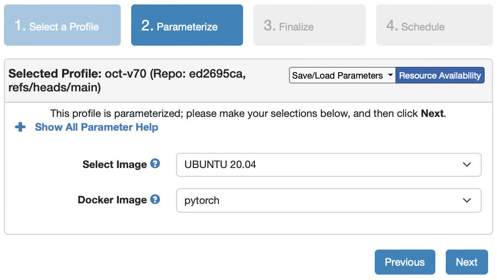
Select the project `OCTFPGA` and click Next.
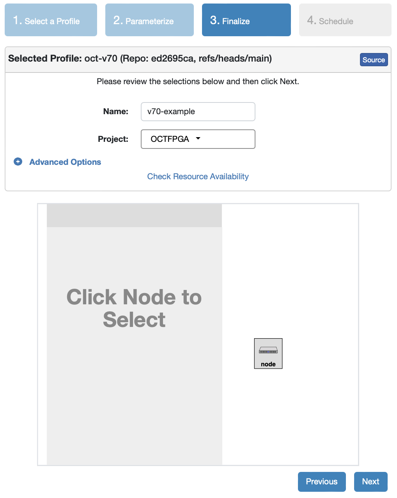
Then click `Finish` to start the experiment.
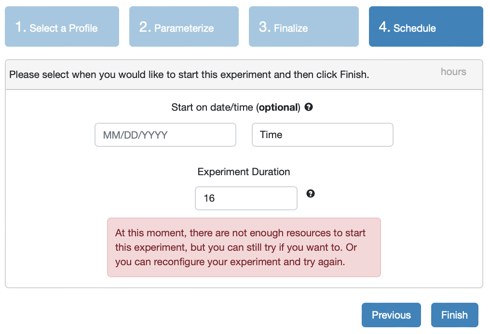
You will notice that a node is being allocated and starting up.
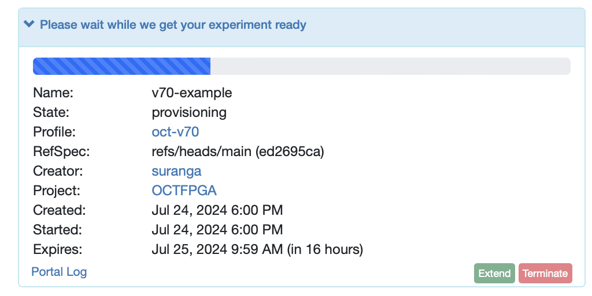
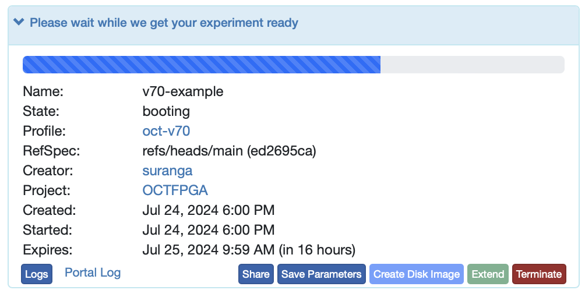
After the node has finished booting up, a startup service will run that installs necessary tools like Docker and a VNC server, which are required to run the example in this tutorial.
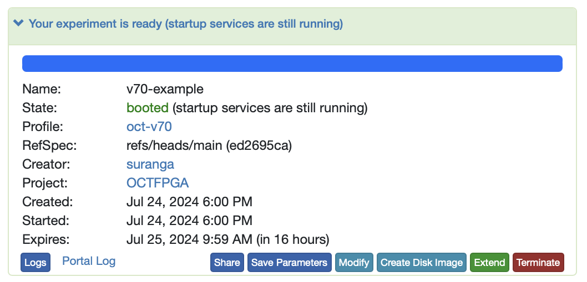
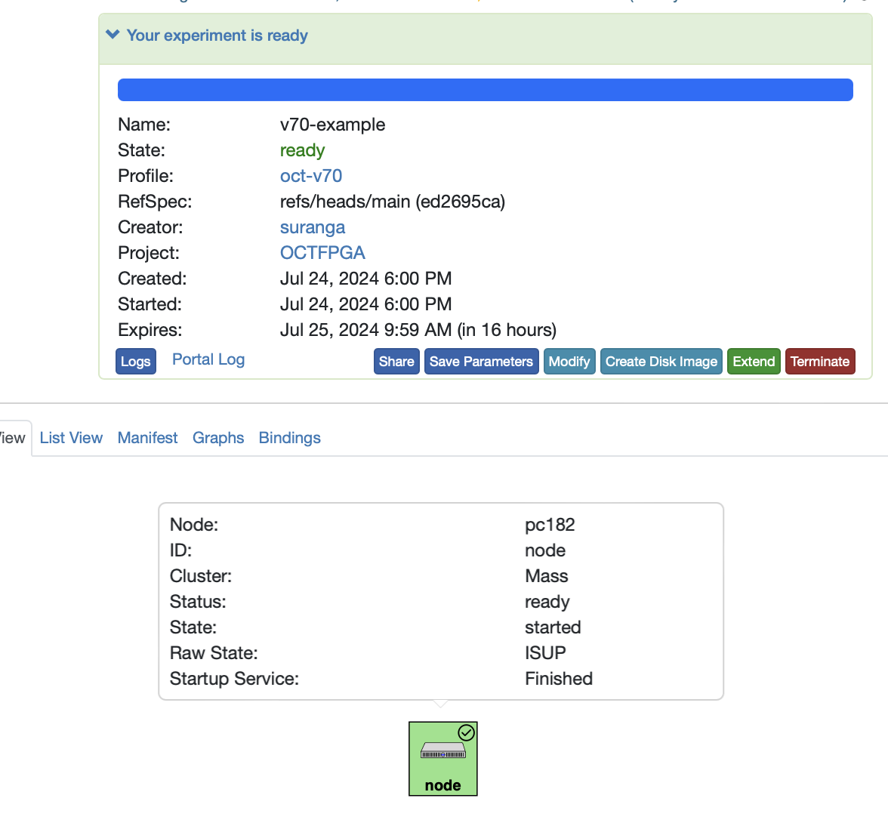
Once the node has finished running the startup script, you can log into the node using SSH.
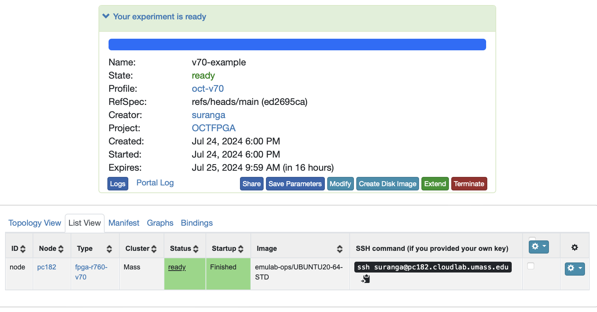
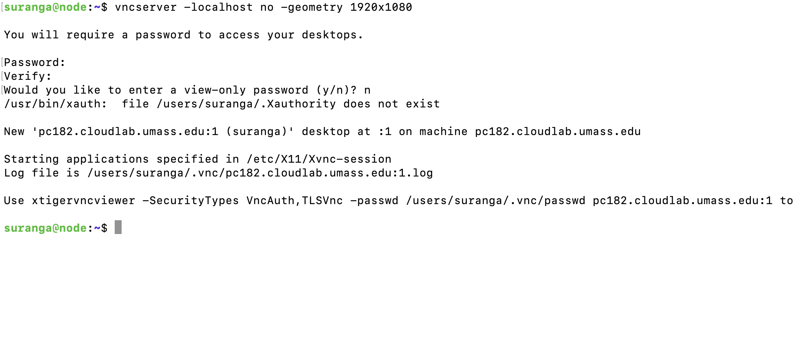
Launch the VNC server on the node you allocated for the experiment.
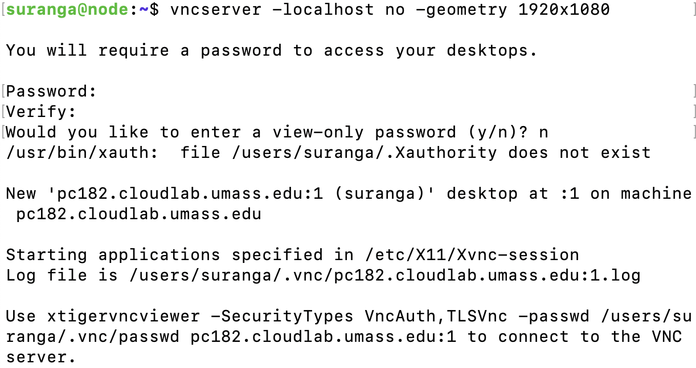
You can use any VNC client to access the graphical desktop of the node you just allocated. In this example, we'll use RealVNC, which can be downloaded [here](https://www.realvnc.com/en/connect/download/viewer/). Configure the VNC client settings on your machine as shown, and connect to the VNC server.
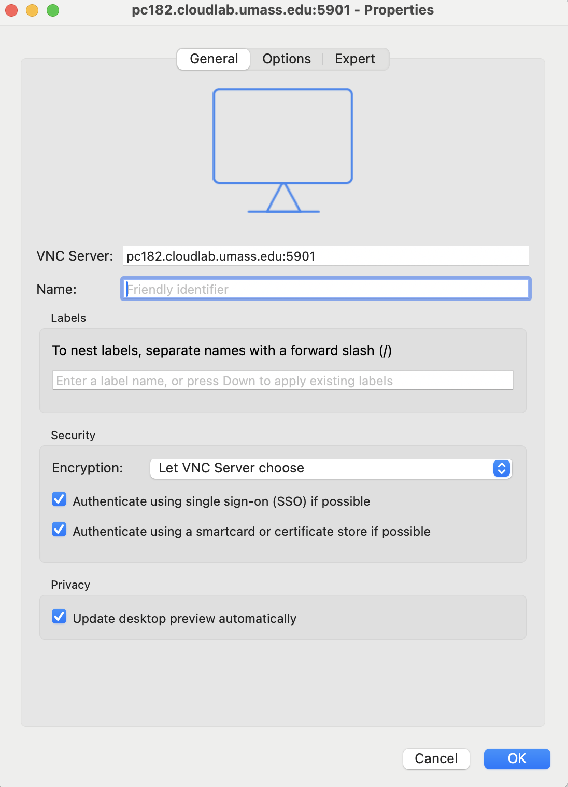
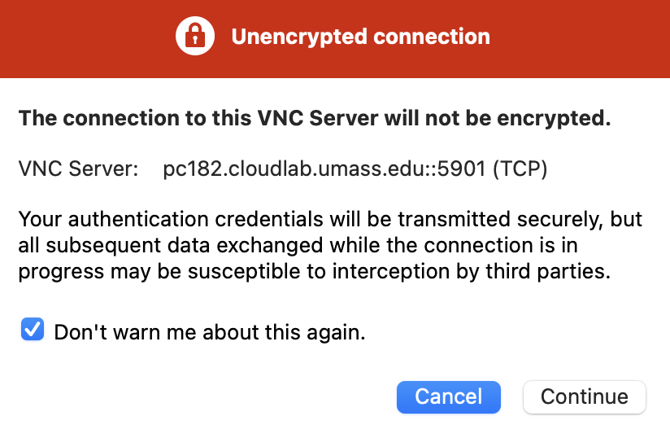
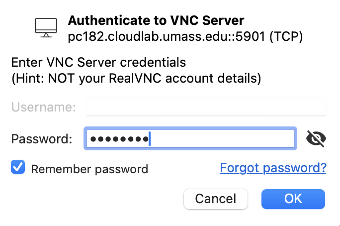
After logging into the graphical desktop of the V70 node, go to the Vitis-AI directory and start the Docker container.
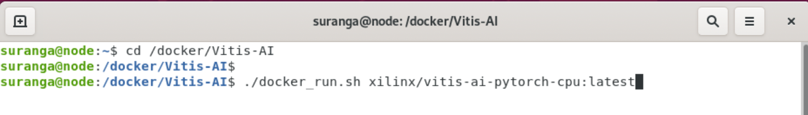
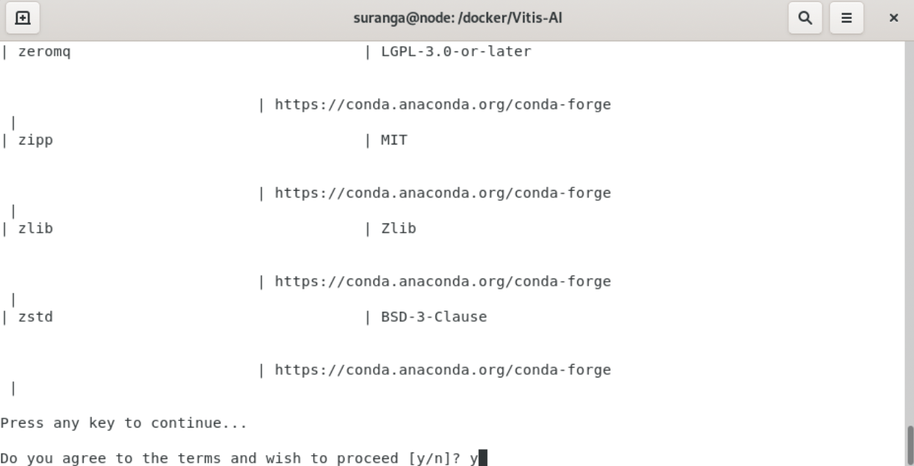
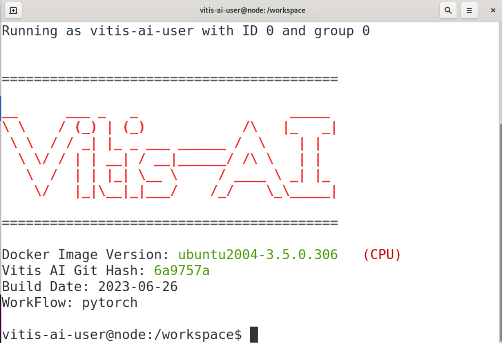
Once you’re inside the Docker container, you can proceed with the V70 example provided [here](https://xilinx.github.io/Vitis-AI/3.5/html/docs/quickstart/v70.html). 
Since the initial steps for setting up the Docker container are already completed, you can go straight to [here](https://xilinx.github.io/Vitis-AI/3.5/html/docs/quickstart/v70.html#docker-container-environment-variable-setup) and continue.

