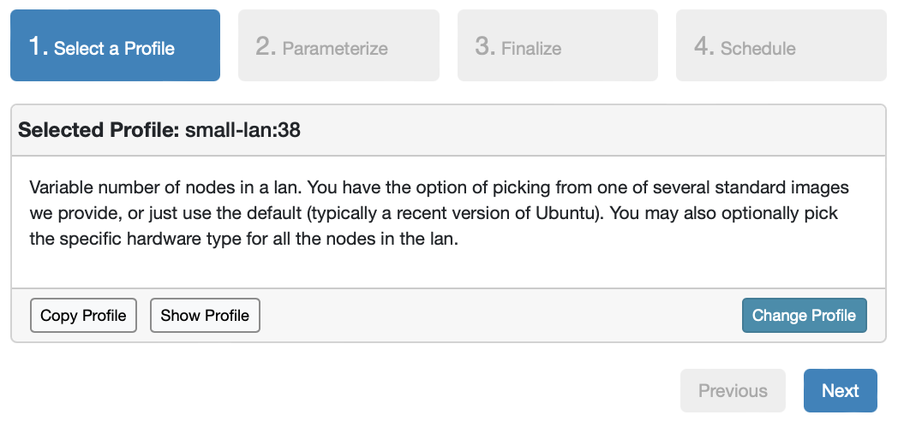
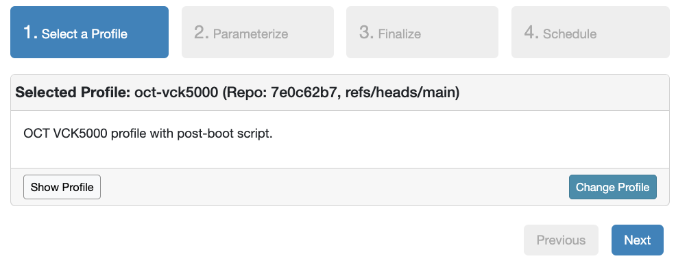
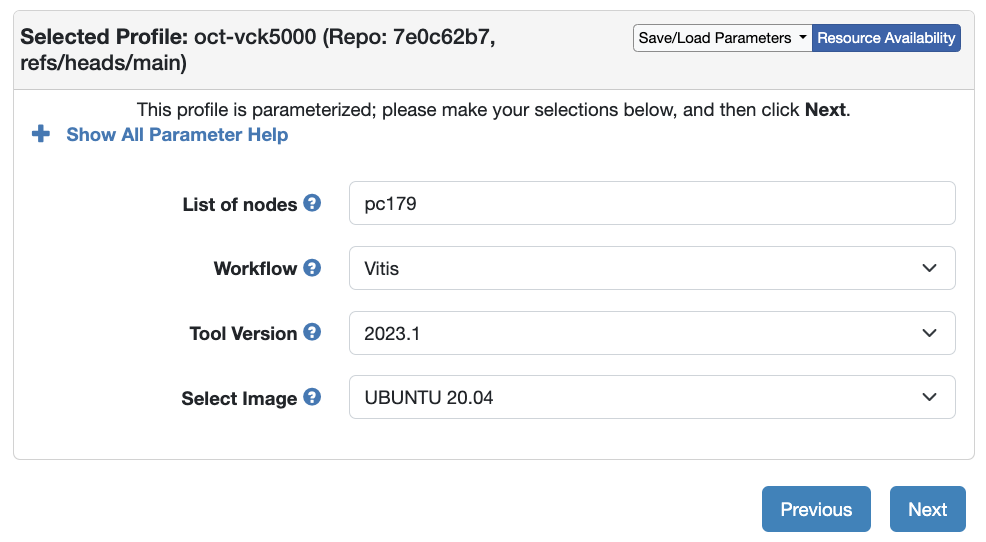
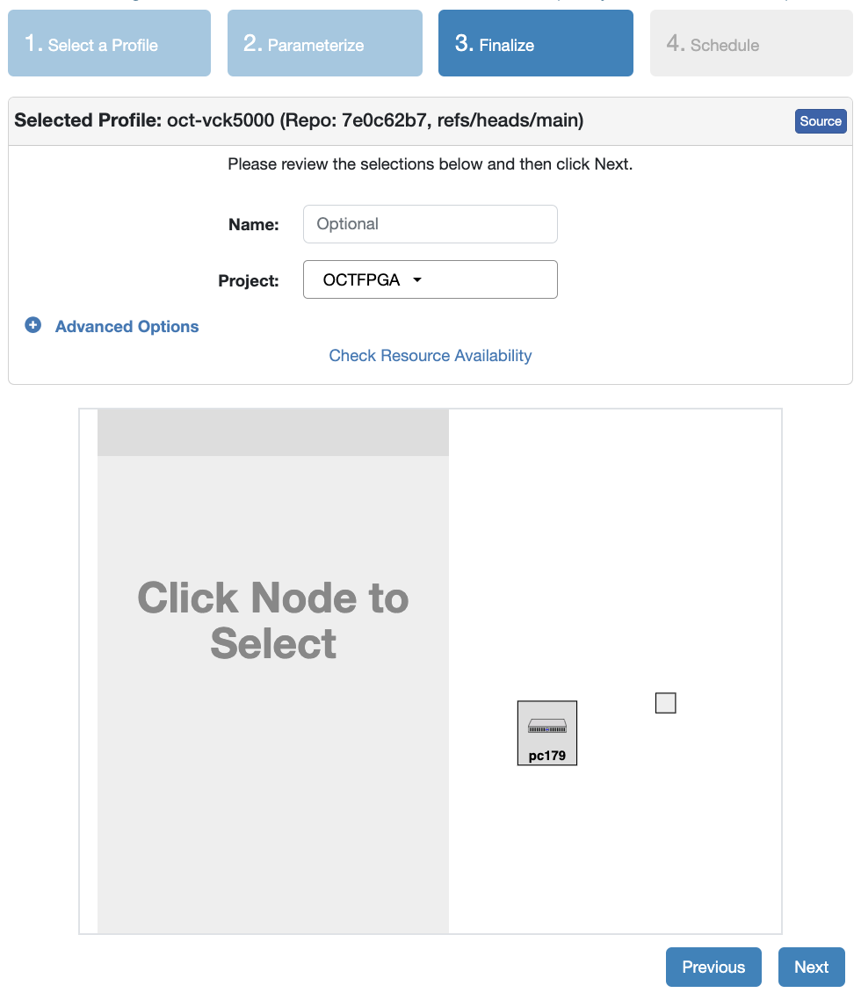
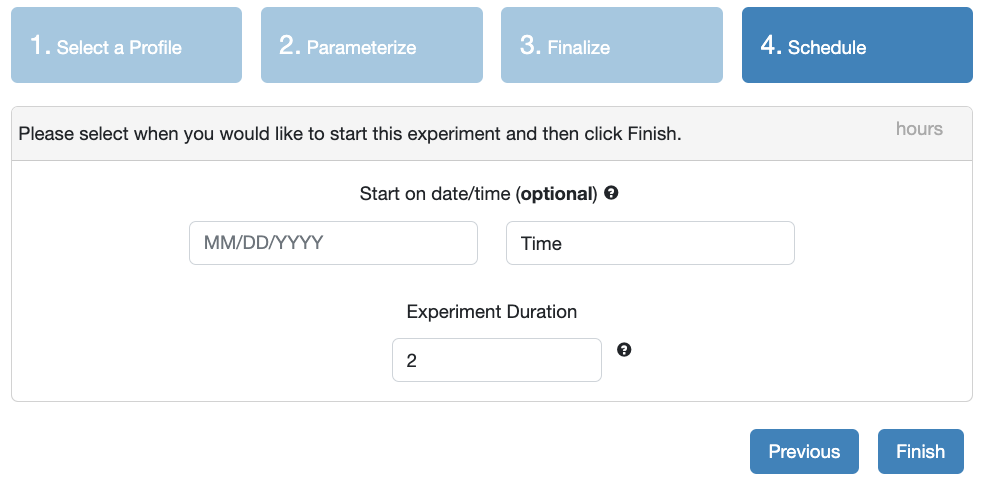
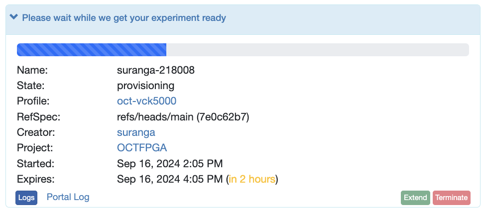
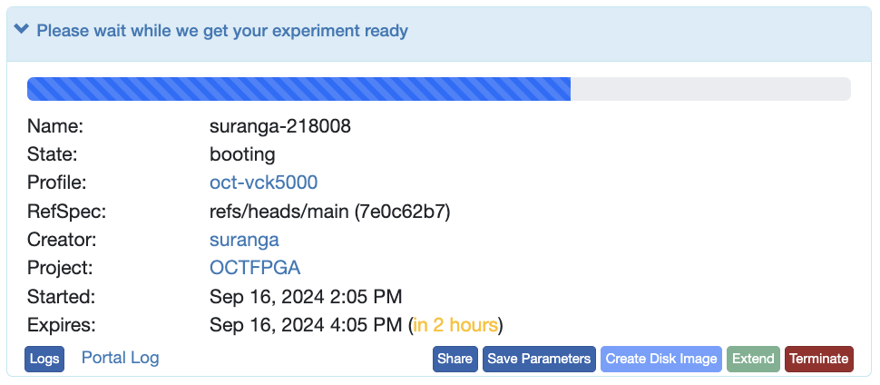
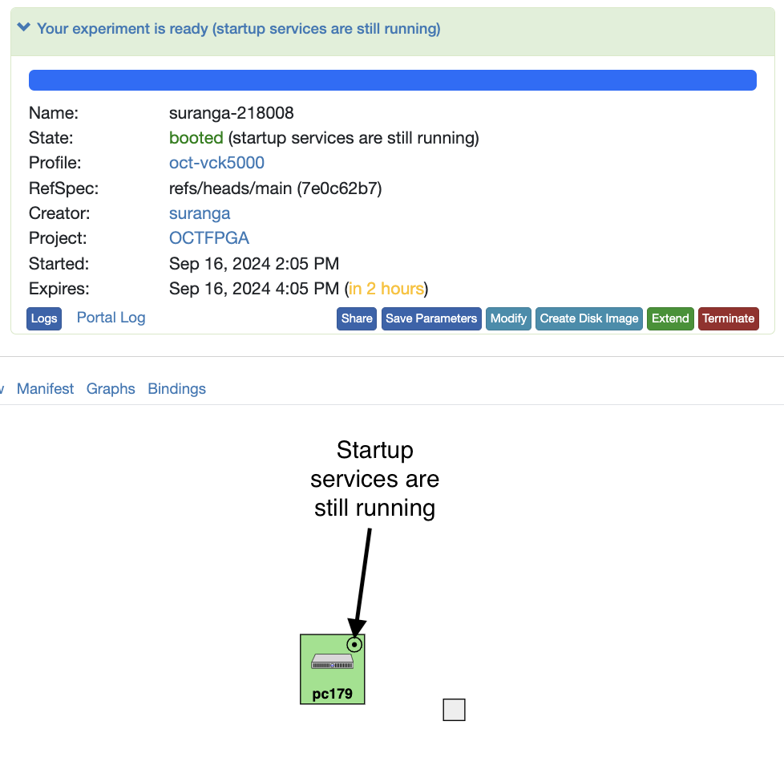
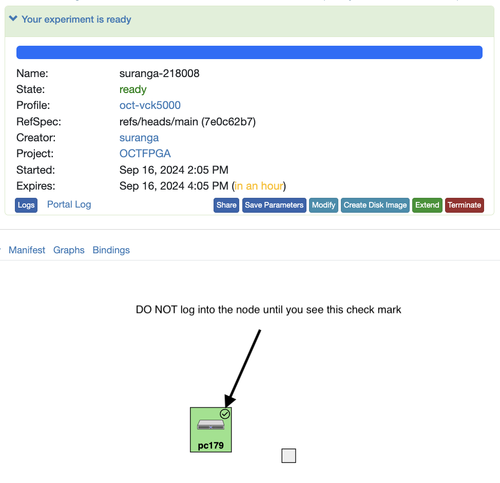

# Getting started with VCK5000 Versal devices in OCT

This tutorial outlines the process of allocating a node with the AMD VCK5000 Versal device in OCT. It also details the steps to execute a sample application using the Vitis acceleration flow.

## Prerequisites

If you haven’t joined the OCTFPGA project yet, you can get started by following [this](https://github.com/OCT-FPGA/OCT-Tutorials/tree/master/cloudlab-setup) tutorial.

## Experiment setup
After logging into the CloudLab account, select Experiments -> Start Experiment, and click `Change Profile`.

Type `oct-vck5000` in the profile search box.
 
Select the profile `oct-vck5000`.

Click Next.

Specify the node(s) with VCK5000s under "List of nodes". For this experiment, one node will be used. Node availability can be checked at the cluster status page: https://cloudlab.us/cluster-status.php. Scroll to the bottom of the cluster status page to see the "Mass Nodes" table. The nodes pc176 through pc179 are designated for VCK5000s. Any available node from this set can be selected and its ID should be entered (for example, pc179).

You will use the Vitis flow in this tutorial. Leave the default selection as is, and click Next.

Select the project `OCTFPGA` and click Next.

Set the experiment duration and click `Finish` to start the experiment. 

You will notice that a node is being allocated and starting up.

After the node has finished booting up, a startup service will run that installs runtime tools which are required to run the example in this tutorial. The gree node icon shows that statup services are still running.

The startup status indicator will change to a check mark once the startup service has completed. **IMPORTANT: Do not log into the node until the startup service has finished running, as the tools required for this tutorial may not yet be installed.**

Once the node has finished running the startup script, you can click on the node and open the shell or if you prefer, you can use external tools such as PuTTY to ssh into the node.

## Examples

AIE tutorials are available here: https://xilinx.github.io/xup_aie_training/. The [Vector Add Lab](https://xilinx.github.io/xup_aie_training/vadd_lab_cli.html) provides instructions for using the Vitis flow to implement a compute kernel on the VCK5000's AI engine that performs vector addition.
